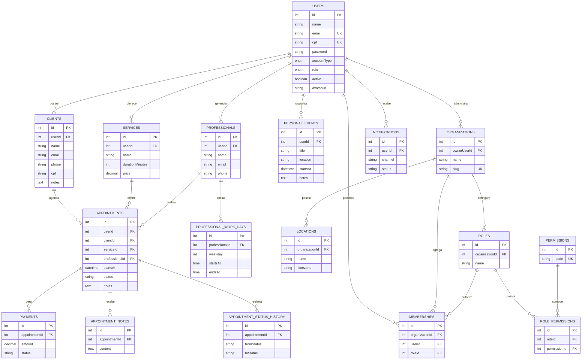
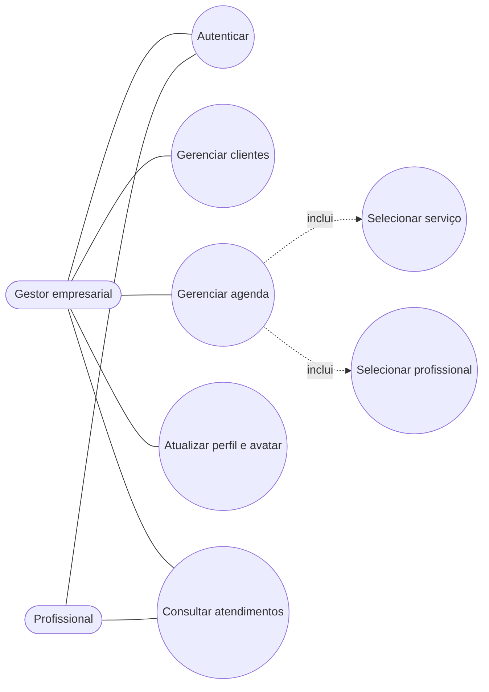
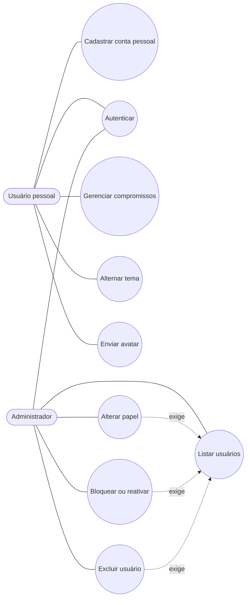
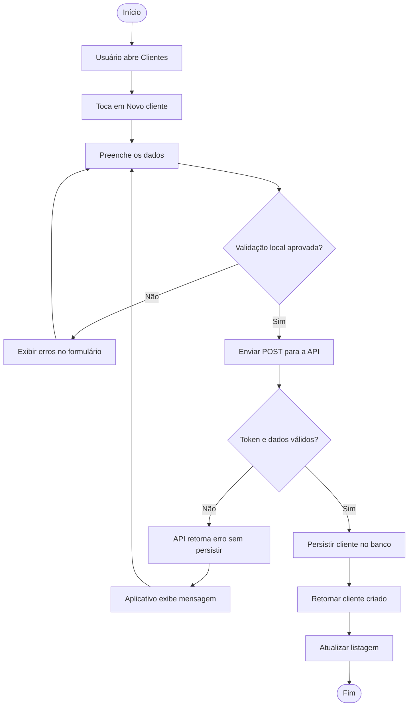
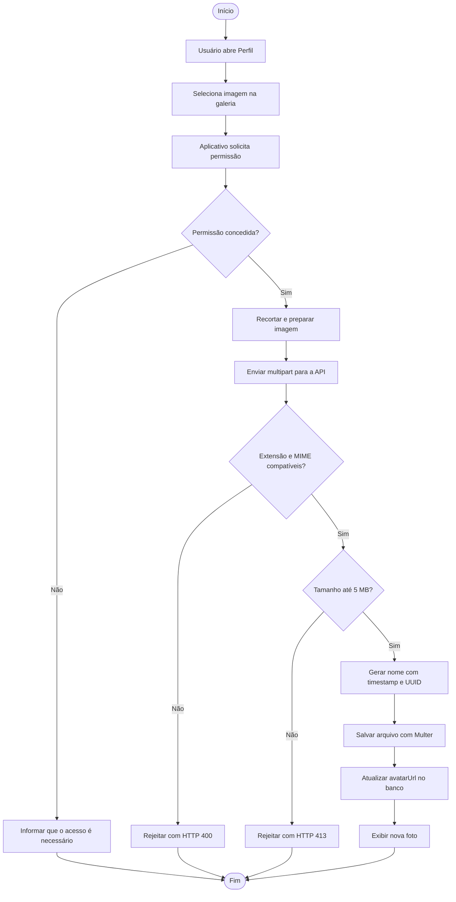
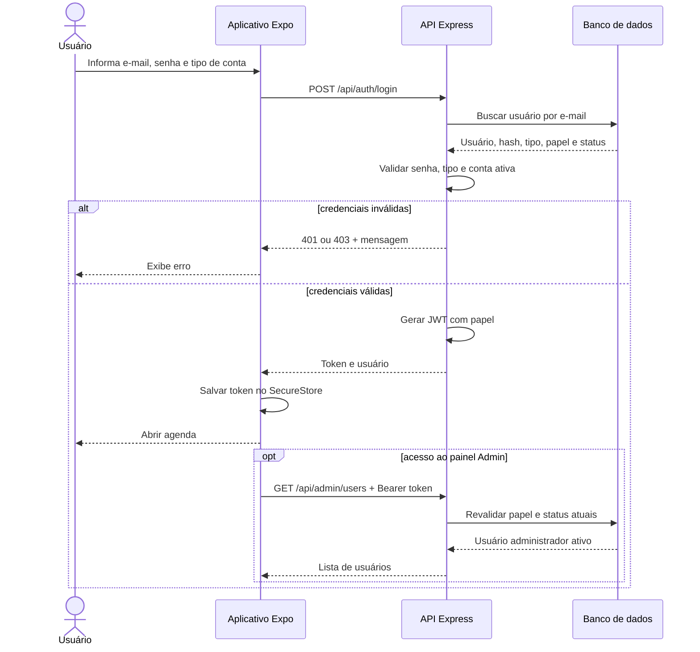
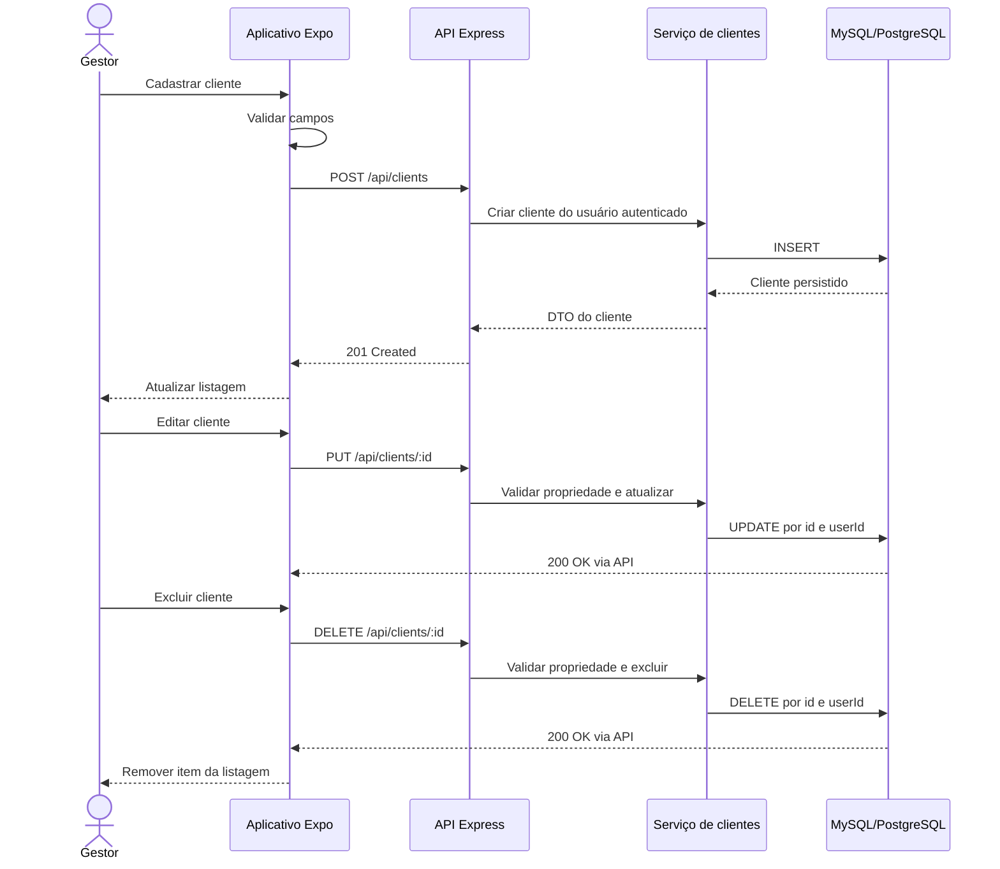

# Diagramas do Schedra

Os diagramas abaixo usam Mermaid e são renderizados diretamente pelo GitHub. Cada fluxo representa funcionalidades implementadas no projeto.

## 1. Diagrama entidade-relacionamento

O DER destaca o núcleo funcional usado pelo aplicativo. As tabelas complementares da plataforma estão catalogadas em `SCHEDRA_PRODUCT_ARCHITECTURE.md`.

## 2. Caso de uso - operação empresarial

## 3. Caso de uso - conta pessoal e administração

## 4. Atividade - cadastrar cliente pelo aplicativo

## 5. Atividade - enviar foto de perfil

## 6. Sequência - autenticação e autorização administrativa

## 7. Sequência - CRUD completo de clientes

## 8. Rastreabilidade dos diagramas

| Exigência | Diagramas apresentados |
| --- | --- |
| Diagrama entidade-relacionamento | Seção 1 |
| Dois casos de uso | Seções 2 e 3 |
| Dois diagramas de atividades | Seções 4 e 5 |
| Dois diagramas de sequência | Seções 6 e 7 |
